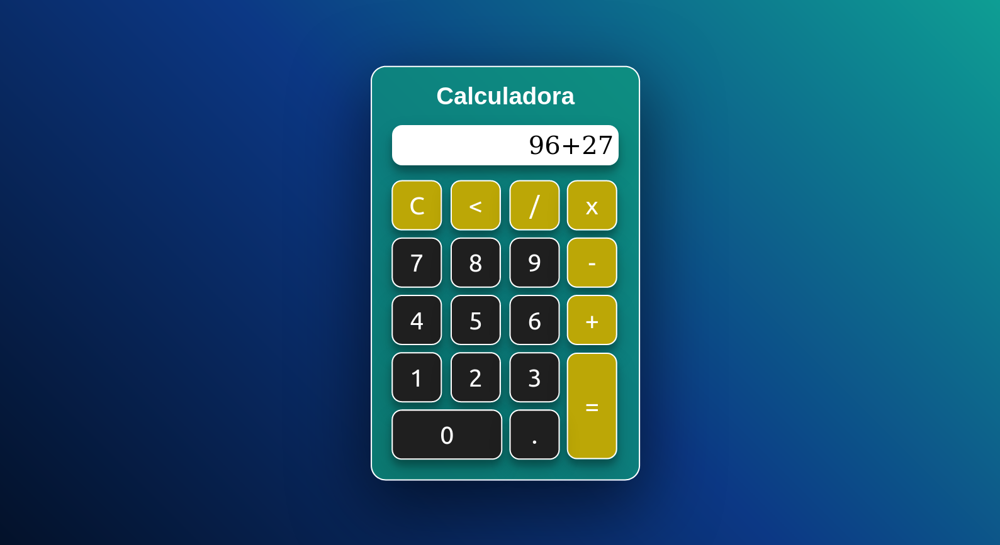

# 🔢 Calculadora Simples

O objetivo com este projeto é fazer uma calculado simplificada, com operações básicas.

## 🚩 Prévia

<h4 align="center"><a href="https://brunnuscz.github.io/simple-calculator/">Clique aqui para visitar o projeto</a></h4>

## 📚 Materiais

- HTML (Hypertext Markup Language)
- CSS (Cascading Style Sheet)
- JS (JavaScript)

## 📁 Projeto
### 📍 Fazendo o clone do repositório:

    git clone https://github.com/brunnuscz/simple-calculator.git

### 📍 Entrando no repositório baixado. Para acessar a página, abra o arquivo index.html no navegador:

    cd simple-calculator
